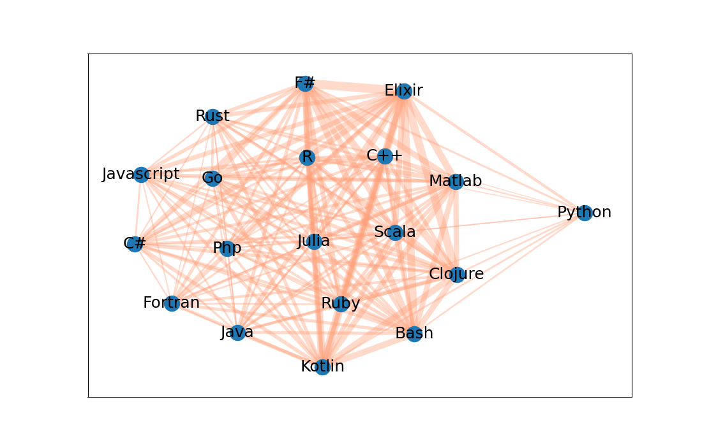
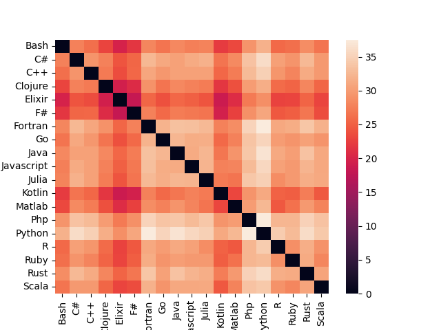

# Unsupervised machine learning on Wikipedia entries for popular programming languages 

# What
This program downloads wikipedia entries on various programming languages, extracts out the key **noun phrases** in the text and then produces a force-directed graph and heatmap to show the 'distances' between the programming languages.

# Results
* Shorter distances are represented with thicker lines.  
* The distance criteria and source data can easily be tuned to pull out a particular relationship. 
* These figures are updated every time the script is run.

# Why
* This project showcases finding dynamic relationships in a set of documents and showing a concise visual output. It showcases skills with **python, MongoDB, NetworkX, Sci-kit learn,** and **good programming practices**. The 'programming language' topic was chosen as a personal interest but it could be switched for something else, for example monitoring some important business-related topics, people, or companies. 

# Use cases 
* Monitor a set of websites for changing relationships or patterns
* Visually summarize a large amount of information in graph form
* Can be run on a server via a *cron job* to produce a graph on a webpage that updates at regular intervals 

# How
* `ingest.py`
1. Page data and retrieval pulled from Wikipedia via their RestAPI
1. Data stored in a MongoDB database using the *pymongo* package

* `eda.py` 
1. **Noun phrases** extracted with a regular expression to create a count matrix
1. Term-frequency inverse-document frequency **(TFIDF)** applied to the count matrix
1. The distance matrix for the documents is created using the *Scipy* module
1. Heatmap and **force-directed graph** produced using *Seaborn*, *Matplotlib*, and *NetworkX* python libraries

* `wrappers/`
1. An interface module that ingest.py and eda.py can call instead of talking directly to the database. 

* Project planning and task management handled with *Miro* 

# Notes
1. A database wrapper class was written to isolate the MongoDB dependency. This enables easy switching of the database dependency to postgres, local file cache, or other cloud storage.
1. There is a test suite in *tests/* folder that can be executed with `pytest tests/`. Note that the tests will fail if MongoDB server is not running.
